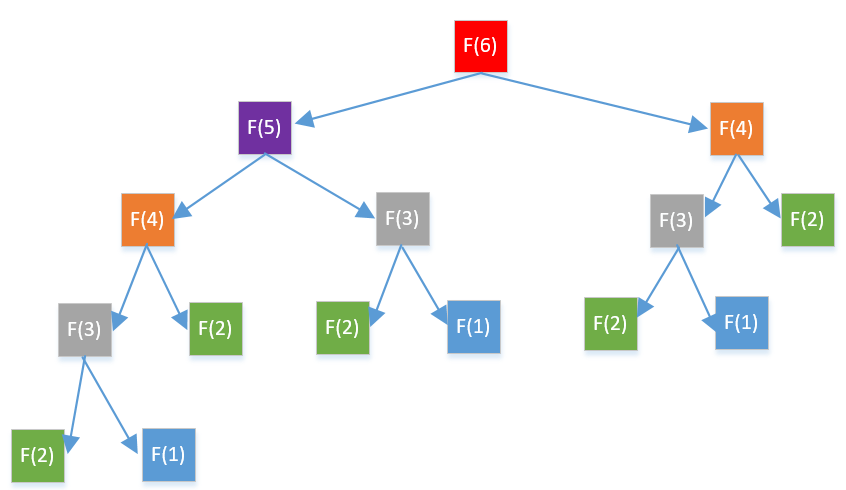

### 70. 爬楼梯

https://leetcode-cn.com/problems/climbing-stairs/


动态规划

爬第n阶楼梯的方法数量，等于 2 部分之和

爬上 n-1阶楼梯的方法数量。因为再爬1阶就能到第n阶、爬上 n-2 阶楼梯的方法数量，因为再爬2阶就能到第n阶

状态转移方程：f(x) = f(x-1) + f(x-1)


```js
/**
 * @param {number} n
 * @return {number}
 */
var climbStairs = function(n) {
    if (n === 0 || n === 1 || n === 2) return n
    let stepWays = [1, 2]
    for (let i = 2; i < n; i++) {
        stepWays[i] = stepWays[i-1] + stepWays[i-2]
    }
    return stepWays[n-1]
};
```

类似斐波那契数列，递归求解（超时），递归存在大量重复计算，需要缓存部分计算结果，空间换时间

[斐波那契数列递归求解的优化](https://zhuanlan.zhihu.com/p/108269159)


```js
/**
 * @param {number} n
 * @return {number}
 */

var climbStairs = function(n) {
    if (n === 0 || n === 1 || n === 2) return n
    return climbStairs(n-1) + climbStairs(n-2)
};


// 以上递归求解会超时，因为存在大量重复计算。可以将计算的结果缓存一起，大大减少耗时
/**
 * @param {number} n
 * @return {number}
 */
const map = new Map()
map.set(0, 0)
map.set(1, 1)
map.set(2, 2)

var climbStairs = function(n) {
    if (typeof map.get(n) === 'number') return map.get(n)
    ret = climbStairs(n-1) + climbStairs(n-2)
    map.set(n, ret)
    return ret
};

```


尾递归优化（原理与变量替换相同）  // TODO 原理理解与普通递归区别
```js
/**
 * @param {number} n
 * @return {number}
 */
var climbStairs = function(n) {
    return climb(n, 0, 1)
};

function climb(n, s1, s2) {
    if (n === 0) {
        return s2
    }
    return climb(n-1, s2, s1+s2)
}
```

变量替换
```js
/**
 * @param {number} n
 * @return {number}
 */
var climbStairs = function(n) {
    let i = 0, j = 1, sum = 0
    for (let p = 0; p < n; p++) {
        sum = i + j
        i = j
        j = sum
    }
    return sum
};
```

- 尾递归，进入下一个函数不再需要上一个函数的环境了，得出结果以后直接返回。
- 非尾递归，下一个函数结束以后此函数还有后续，所以必须保存本身的环境以供处理返回值。
- [递归和尾递归的区别和原理](https://blog.csdn.net/zcyzsy/article/details/77151709)
```js
// 递归求阶乘
function fact(n) {
  if (n < 0)
    return 0;
  else if(n == 0 || n == 1)
    return 1;
  else
    return n * fact(n - 1);
}

// 尾递归求阶乘
function facttail(n, res)
{
  if (n < 0)
    return 0;
  else if(n == 0)
    return 1;
  else if(n == 1)
    return res;
  else
    return facttail(n - 1, n*res);
}
```
